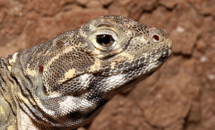

---
title:
author: "cjlortie"
date: "2018"
output:
  html_document:
    theme: yeti
    toc: yes
    toc_depth: 3
    toc_float: yes
  pdf_document:
    toc: yes
---
#Telemetry analytics of blunt-nosed leopard lizards
<br>

###Purpose
To use telemetry to examine Gambelia sila frequency of habitat use within a desert ecosystem.


<br>


<br>
[ecoblender](http://ecoblender.org)
<br>

###Methods
A total of 30 lizards were instrumented in the Carrizo National Monument by Westphal and team. Individual animals were monitored for relocation patterns, georeferenced, and detailed observation applied to a subset of animals. Note: all telemetry work was done at site #4 on Elkhorn.


```{r, library, warnings = FALSE, message=FALSE, echo=FALSE}
#library loads
#wrangling
library(tidyverse)

#packages <- c("rgdal", "maps", "multcomp", "nnet", "adehabitatHR", "raster", "maptools", "leaflet")

#basic maps
library(rgdal)
library(maps)

#models & posthoc tests
library(multcomp)
library(nnet) #package to run a multinomial linear regression

#habitat
library(adehabitatHR)
library(raster) 
library(rgdal)
library(maptools)
```

###Primary data
```{r, data}
#load data####
data <- read_csv("data/telemetry.relocations.csv")
library(hms)
data$time <- as.hms(data$time)
data
data$rep <- as.character(data$rep)
#data <- data %>% mutate(day.time = if(data$time >= 12) { 
  #print("PM")} else {print("AM")
    #})
#data <- data %>% filter(behavior != "avoiding.predators")
#data$behavior <- gsub("standing", "underground", data$behavior)

#wrangle in gender of lizards here
#lizards <- read_csv("data/lizards.2016.csv")
#lizards <- lizards %>% dplyr::select(lizard, gender, mass, length.mm)
#lizards <- lizards %>% filter(gender != "uk")
#data <- left_join(data, lizards, by = "lizard")  

#the 'data' dataframe = a data structure model with every relocation as sample unit - this has non-independence/pseudoreplication issues if used directly in statistical models without nesting variables and careful statistical model builds.

#wrangle for appropriate simplified data structures####
#population-level data structure####
#data structure models habitat & time as sample units with no non-independence issues
#pop.data <-data %>% group_by(mesohabitat, microhabitat.simple, time.class, behavior) %>% count(behavior)
#pop.data #n equals number of days by am/pm (77).

#pop-data with gender
#pop.data.gen <-data %>% 
  #group_by(gender, mesohabitat, microhabitat.simple, time.class, behavior) %>% 
  #count(behavior)
#pop.data.gen #n equals number of days by am/pm (77).

#lizard-level data structure####
#data structure models individual lizards as sample unit
#lizard.data <- data %>% group_by(lizard, gender, mesohabitat, microhabitat.simple, time.class, behavior) %>% count(behavior)
#lizard.data #n equals each lizard in every habitat scale by time so time and space not fully independently sampled but each lizard is sample unit with repeated measures (396).

#lizard-level weighted frequencies could be added here too
#sum up total relocations per lizard by mesohabitat (n) then divide the shrub/open totals by N.
#lizard.freq <- lizard.data %>% 
  #group_by(lizard, gender, mesohabitat) %>% 
  #summarise(total.relocations = sum(n))

#lizard.totals <- lizard.data %>% 
  #group_by(lizard, gender) %>% 
  #summarize(totals = sum(n)) %>% dplyr::select(-gender)

#lizard.freq <- left_join(lizard.freq, lizard.totals, by = "lizard") %>% mutate(proportionate.association = total.relocations/totals)

#timing####
timing <- data %>% group_by(date, time.class, behavior) %>% count()
#timing

lizard.sampling <- data %>% 
  group_by(lizard, date) %>% count() %>% summarize(count = sum(n))
lizard.sampling
summary(lizard.sampling)
length(unique(lizard.sampling$lizard))

lizard.days <- lizard.sampling %>% group_by(lizard) %>% count()
lizard.days
summary(lizard.days)
greater.than.5 <- lizard.days %>%
  mutate(threshold = case_when(n < 5 ~ 0, n >=5 ~ 1))

sum(greater.than.5$threshold)

greater.than.0 <- lizard.days %>%
  mutate(threshold = case_when(n < 1 ~ 0, n >= 1 ~ 1))
sum(greater.than.0$threshold)

days <- lizard.sampling %>% 
  group_by(date) %>%
  count()
days
summary(days)

#distributions####
#require(fitdistrplus)

#pop data structure
#plotdist(counts$n)
#descdist(counts$n, boot = 1000)
#fit.p <- fitdist(counts$n, "pois")
#summary(fit.p)

#individual data structure
#plotdist(lizards$n)
#descdist(lizards$n, boot = 1000)
#fit.p <- fitdist(lizards$n, "pois")
#summary(fit.p)
```

###Maps
```{r, map, warnings = FALSE, message=FALSE}
#ggmap
require(ggmap)
cali <- get_map(location = c(lon = -119.625, lat = 35.12), zoom = 15)
#cali <-get_googlemap("california", crop= FALSE, zoom = 10)
p <-ggmap(cali)
p + geom_point(data=data, aes(x=long, y=lat, color = rep), alpha = .5, size = 1) + scale_color_brewer(type = 'seq', palette = "Set1") + labs(x = "longitude", y = "latitude", color = "day")

```

###Home-range models
```{r, home-range analytics, message=FALSE, warning = FALSE, error=TRUE}
#simplify data
s.data <- data %>%
  dplyr::select(-year, -rep)

#select only lizards with 5 or more relocations
check <- as.data.frame(table(data$lizard))
check %>% 
  arrange(desc(Freq))

s.data <- s.data %>% 
  dplyr::filter(lizard != "12B" & lizard != "47") #were not 5 relocations

#convert to UTM and set units to m
track.pop <-s.data
coordinates(track.pop) <- ~long+lat
proj4string(track.pop) <- CRS("+proj=longlat") #assign projection and coordinate reference system
track.pop <- spTransform(track.pop, CRS("+proj=utm +zone=10")) #transform

#Minimum Convex Polygon####
#Population
mcp.pop <- adehabitatHR::mcp(track.pop, percent=95, unin = c("m"), unout = c("km2")) #unout is units out
mcp.pop
as.data.frame(mcp.pop)
plot(mcp.pop)
plot(track.pop, add= TRUE)

#Individuals
mcp.ind <- mcp(track.pop[,1], percent=95, unin = c("m"), unout = c("m")) #adding the [,1] tells it the ID and then does individually instead of collectively.
#mcp.pop <- mcp(track.pop[,1], percent=95, unin = c("km"), unout = c("km")) 
mcp.ind #total area each lizard occupies
as.data.frame(mcp.ind)

plot(mcp.ind, col= mcp.ind$id)


plot(mcp.pop)
plot(track.pop, add= TRUE, col= mcp.ind$id)

#areas via mcp calc for each individual converted to ha
#areas <- as.data.frame(mcp.ind)
#areas <- areas %>% 
  #rename(lizard = id)

#areas <- left_join(areas, lizards, by = "lizard")  
#areas <- areas %>% 
  #na.omit(gender) %>% 
  #mutate(area.ha = area *0.0001) %>% dplyr::select(-area)
#write_csv(areas, "data/areas.csv")
#areas

#summ.areas <- areas %>%
  #group_by(gender) %>%
  #summarize(mean.ha = mean(area.ha), se = #sd(area.ha)/sqrt(length(area.ha)))
#summ.areas
          

#MCP Area####
#Population
mcp.area <- mcp.area(track.pop, percent = seq(20,100, by = 5), unin = c("m"), unout = c("km2"), plotit = FALSE)
mcp.area
as.data.frame(mcp.area)
mcp.area <- mcp.area %>% mutate(step=seq(20,100, 5))
summary(mcp.area) #mean hr size for all lizards tracked

ggplot(mcp.area, aes(step, a)) + geom_point() + geom_smooth(se = FALSE) + 
  xlab("home-range level") + 
  ylab("home-range size in km2")

#Individual
mcp.area.ind <- mcp.area(track.pop[,1], percent = seq(20,100, by = 5), unin = c("m"), unout = c("km2"), plotit = FALSE)
mcp.area.ind #curves
as.data.frame(mcp.area.ind)

individuals <- mcp.area.ind %>% mutate(step=seq(20,100, 5))
individuals <- as_tibble(individuals)
individuals <- individuals %>% gather(c(1:28), key = "individual", value = "mcp.area")

ggplot(individuals, aes(step, mcp.area, color = individual)) + geom_point() + geom_smooth(se = FALSE) + 
  xlab("home-range level") + 
  ylab("home-range size in km2")

#wrangle in lizard traits###
#individuals <- individuals %>% 
  rename(lizard = individual)
#individuals <- left_join(individuals, lizards, by = "lizard")  

#individuals <- individuals %>% 
  #na.omit(gender) %>% mutate(area.ha = mcp.area*100)


#ggplot(individuals, aes(step, mcp.area, color = gender)) + geom_point() + geom_smooth() + 
  #xlab("home-range level") + 
  #ylab("home-range size in km2")

#ggplot(individuals, aes(step, area.ha, color = gender)) + geom_point() + geom_smooth() + 
  #xlab("home-range level") + 
  #ylab("home-range size in ha")

#area.summary <- individuals %>%
  #group_by(gender) %>%
  #filter(step == 100) %>%
  #summarise(mean.ha = mean(area.ha), se = sd(area.ha)/sqrt(length(area.ha)))
#area.summary

#max.area <- individuals %>%
  #filter(step == 100)
#m <- glm(area.ha~gender + mass, family = gaussian, max.area)
#anova(m, test = "Chisq")

#t.test(max.area$area.ha~max.area$gender)

#m <- glm(area.ha~gender*mass, family = gaussian, max.area)
#anova(m, test = "Chisq")

#ggplot(max.area, aes(gender, area.ha)) +
  #geom_boxplot()

#ggplot(max.area, aes(mass, area.ha, color = gender)) +
  #geom_point() +
  #geom_smooth(method = "lm") +
  #labs(x = "mass in g at capture", y = "area in ha")

#summary(lm(area.ha~mass + gender, data = max.area))

```